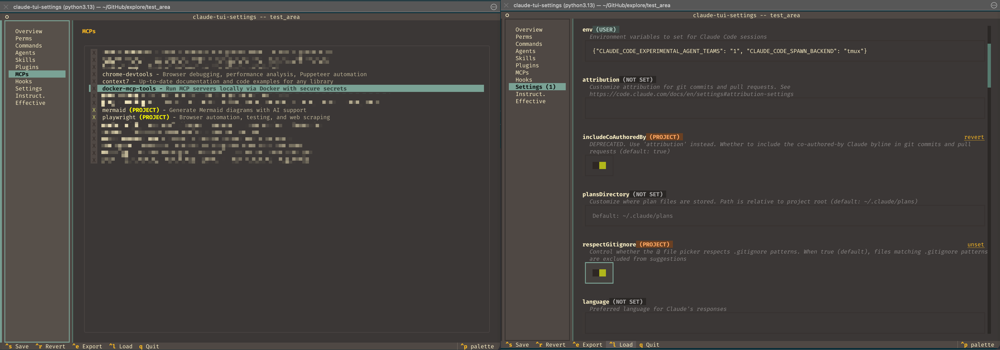

```
#             ██████╗██╗      █████╗ ██╗   ██╗██████╗ ███████╗                 
#            ██╔════╝██║     ██╔══██╗██║   ██║██╔══██╗██╔════╝                 
#            ██║     ██║     ███████║██║   ██║██║  ██║█████╗                   
#            ██║     ██║     ██╔══██║██║   ██║██║  ██║██╔══╝                   
#            ╚██████╗███████╗██║  ██║╚██████╔╝██████╔╝███████╗                 
#             ╚═════╝╚══════╝╚═╝  ╚═╝ ╚═════╝ ╚═════╝ ╚══════╝                 
#                                                                                
#    ████████╗██╗   ██╗██╗    ████████╗ ██████╗  ██████╗ ██╗     ███████╗          
#    ╚══██╔══╝██║   ██║██║    ╚══██╔══╝██╔═══██╗██╔═══██╗██║     ██╔════╝          
#       ██║   ██║   ██║██║       ██║   ██║   ██║██║   ██║██║     ███████╗          
#       ██║   ██║   ██║██║       ██║   ██║   ██║██║   ██║██║     ╚════██║          
#       ██║   ╚██████╔╝██║       ██║   ╚██████╔╝╚██████╔╝███████╗███████║          
#       ╚═╝    ╚═════╝ ╚═╝       ╚═╝    ╚═════╝  ╚═════╝ ╚══════╝╚══════╝          
#                                                                                  
```

**TUI companion tools for Claude Code — settings management and usage monitoring.**

Addressing small pain points for solo developers, and small teams using Claude Code CLI.

---

## Tools

### claude-tui-settings

> **The problem:** Claude Code settings are scattered across 5 scopes with confusing precedence. Where is that setting actually coming from?

A Textual TUI dashboard that gives you clarity and centralized control over Claude Code's multi-scope project settings. 
> [!TIP] I use it quickly run it ahead of initialising a new project, or run claude with `claude-tui-settings --report && claude` to recap what settings/plugins/MCPs etc will be available ready to go.




### claude-tui-usage

> **The Pain Point:** Running `/usage` all the time is a pain - it's hard to see how you're pacing against your rate limit window.

A visual, pace-aware CLI monitor that shows your consumption pace vs. elapsed time so you can adjust before you hit the wall. 
> [!TIP] I like to run with `--loop` and have it refresh every 10 mins or so...

<p align="center">
  
</p>

---

## Quick Start

Install each tool independently:

```bash
# Settings dashboard
pip install git+https://github.com/ajanderson1/claude-tui-tools.git#subdirectory=packages/settings

# Usage monitor
pip install git+https://github.com/ajanderson1/claude-tui-tools.git#subdirectory=packages/usage
```

Or install both for local development:

```bash
git clone https://github.com/ajanderson1/claude-tui-tools.git
cd claude-tui-tools
pip install -e ".[all]"
```

Then run:

```bash
claude-tui-settings          # Launch the settings TUI
claude-tui-usage             # Single usage check
claude-tui-usage --loop      # Continuous monitoring
```

---

## Requirements

| Tool | Python | Dependencies |
|------|--------|-------------|
| claude-tui-settings | >= 3.10 | [Textual](https://textual.textualize.io/), httpx |
| claude-tui-usage | >= 3.9 | python-dateutil, [`expect`](https://core.tcl-lang.org/expect/) |

**claude-tui-settings** requires the `$CLAUDE_REPO` environment variable pointing to your Claude Code resource repository:

```bash
export CLAUDE_REPO=/path/to/your/claude-repo
```

**claude-tui-usage** requires the `expect` binary for terminal automation:

```bash
# macOS
brew install expect

# Linux
apt-get install expect
```

**Note:** The usage monitor uses `pkill -f` to clean up spawned `claude /usage` processes after capture. This is normal and expected behavior.

---

## Detailed Docs

- [claude-tui-settings](packages/settings/README.md) — all CLI flags, configuration scopes, TUI navigation
- [claude-tui-usage](packages/usage/README.md) — all CLI flags, loop mode, debug output, exit codes

## License

MIT — see [LICENSE](LICENSE).
