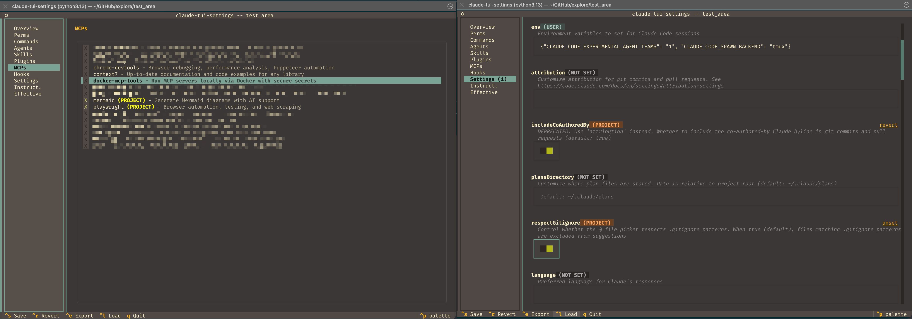

```
#             ██████╗██╗      █████╗ ██╗   ██╗██████╗ ███████╗                #
#            ██╔════╝██║     ██╔══██╗██║   ██║██╔══██╗██╔════╝                #
#            ██║     ██║     ███████║██║   ██║██║  ██║█████╗                  #
#            ██║     ██║     ██╔══██║██║   ██║██║  ██║██╔══╝                  #
#            ╚██████╗███████╗██║  ██║╚██████╔╝██████╔╝███████╗                #
#             ╚═════╝╚══════╝╚═╝  ╚═╝ ╚═════╝ ╚═════╝ ╚══════╝                #
#                                                                             #
#    ████████╗██╗   ██╗██╗    ████████╗ ██████╗  ██████╗ ██╗     ███████╗     #
#    ╚══██╔══╝██║   ██║██║    ╚══██╔══╝██╔═══██╗██╔═══██╗██║     ██╔════╝     #
#       ██║   ██║   ██║██║       ██║   ██║   ██║██║   ██║██║     ███████╗     #
#       ██║   ██║   ██║██║       ██║   ██║   ██║██║   ██║██║     ╚════██║     #
#       ██║   ╚██████╔╝██║       ██║   ╚██████╔╝╚██████╔╝███████╗███████║     #
#       ╚═╝    ╚═════╝ ╚═╝       ╚═╝    ╚═════╝  ╚═════╝ ╚══════╝╚══════╝     #
#                                                                             #
```

**TUI companion tool for Claude Code — settings management.**

Addressing small pain points for solo developers/small teams using Claude Code CLI.

---

## claude-tui-settings

**The pain point:** Claude Code settings are scattered across 5 scopes with confusing precedence. Where is that setting actually coming from?

*Solution:* A Textual TUI dashboard that allows quick clarity and centralized control over Claude Code's multi-scope project settings.

> I run it ahead of initialising a new project to quickly sync custom commands/skills/settings etc, or run with `claude-tui-settings --report && claude` to recap what settings/plugins/MCPs etc will be available ready to go in the claude instance.



---

## Quick Start

```bash
pip install git+https://github.com/ajanderson1/claude-tui-tools.git#subdirectory=packages/settings
```

Or install for local development:

```bash
git clone https://github.com/ajanderson1/claude-tui-tools.git
cd claude-tui-tools
pip install -e ".[all]"
```

Then run:

```bash
claude-tui-settings          # Launch the settings TUI
```

---

## Requirements

| Tool | Python | Dependencies |
|------|--------|-------------|
| claude-tui-settings | >= 3.10 | [Textual](https://textual.textualize.io/), httpx |

### NB: This is crucial to the use case: -
The TUI points to a local dir which serves as a central repo for all claude resources.  Each project is then creating symlinks to reference these.

*Why?*
I constantly refine and update my custom commands/skills etc so I find updating a git-versioned custom plugin, pushing the repo, pulling back to my claude project (+ then actually ensuring that it *has* updated) is painful. So I prefer to link it directly to cut out this lead time until such time as I am no longer updating so frequently.


**claude-tui-settings** requires the `$CLAUDE_REPO` environment variable pointing to your Claude Code resource repository:
```bash
export CLAUDE_REPO=/path/to/your/claude-repo
```

---

## Detailed Docs

- [claude-tui-settings](packages/settings/README.md) — all CLI flags, configuration scopes, TUI navigation

## License

MIT — see [LICENSE](LICENSE).
